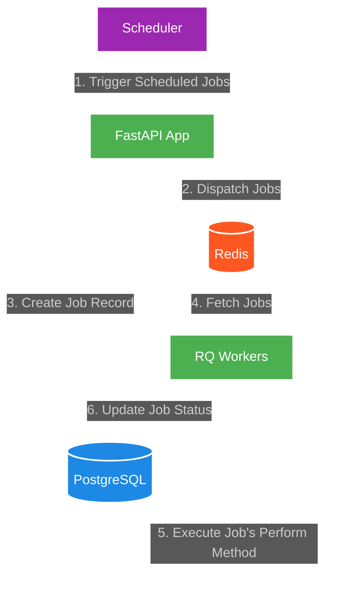

# Asynchronous Job Processing System

## Problem Statement

In large-scale data processing and ETL (Extract, Transform, Load) workflows, organizations often face challenges with scheduling, executing, and monitoring complex database operations. These operations, such as truncating tables, running aggregations, or performing slow queries, need to be executed reliably on a recurring basis without interfering with the main application's performance.


## System Guarantees

Our asynchronous job processing system provides the following guarantees:

🚶‍♂️🚶‍♂️🚶‍♂️ **Job Queueing**: Ability to queue jobs for asynchronous processing without blocking the main application.

🔴 🟡 🟢 **Queue Prioritisation**: Jobs can be assigned to differen queues & these queues can be prioritised. Ex - jobs in "queue=high" should be executed followed by "medium" & "low"

👁️ **Job Status Tracking**: The status of each job (queued, started, completed, failed) is tracked and can be queried.

🔢 **Multiple Reattempts**: A job can be reattempted multiple times with an exponential backoff strategy in case of failure. Currently, the system is configured to retry a job 3 times with increasing intervals between retries (1M, 5M, 15M).

🛢️ **Result Persistence**: Job results or errors are stored in the database for debugging and analysis.

📈 **Scalability**: The system can be easily scaled by adding more workers. Adding more workers is simple by just duplicating the instances of the `worker` service.

🕓 **Job Scheduling**: Jobs can be scheduled to run at specific intervals using the scheduler. Have added a scheduler using APScheduler, which calls the `api` service to queue jobs.

🤸🏻‍♂️ **Extensibility**: New job types can be easily added by creating subclasses of the `BaseJob` class. Refer to the `jobs` directory for couple of examples

🧑‍💻 **Manual Intervention**: Ability to manually retry failed jobs or mark them as completed after fixing the underlying issue. Ex - you can retry a particular failed job or retry all failed jobs

♻️ **Recoverability**: The system is designed to recover from system failures. Ex - in case of a system restart or redis crash, the jobs will be requeued on application restart.

---

## Solution

### System Components
1. **FastAPI Application**: Handles API requests and job dispatching
2. **Redis**: Broker for job queues
3. **Redis Queue (RQ)**: Manages job queues and worker processes
4. **SQLAlchemy**: ORM for database operations
5. **PostgreSQL**: Database for storing job statuses and results
6. **Docker**: Containerization for easy deployment and scaling

### System Diagram



### `BaseJob` Class:

The `BaseJob` class provides a template for creating new job types. Each job class should implement the `handle` method, which contains the actual job logic. Jobs are dispatched using the `dispatch` class method.

It also has all the necessary methods for handling job status updates, retries, and error handling.

You can create new job classes by inheriting from `BaseJob` and implementing the `handle` method. You can pass the required arguments as well as the queue name when dispatching a job.

Example Job Class:

```python
class TruncateTable(BaseJob):
    def __init__(self, table: str, **kwargs):
        super().__init__(**kwargs)
        self.table = table

    def handle(self):
        logger.info(f"Truncating table {self.table}")

        with get_db() as session:
            session.execute(
                text(f"TRUNCATE TABLE {self.table} RESTART IDENTITY CASCADE;")
            )

        logger.info(f"Table {self.table} truncated successfully")

# Usage
TruncateTable.dispatch(table="auth.users", queue="low")
```

### Job Recovery on System Startup
To ensure job persistence and system reliability, our application implements a job recovery mechanism that runs during system startup. This process addresses scenarios where jobs might have been lost due to system failures or Redis downtime.

#### Recovery Process

1. On application startup, the system queries the database for jobs that were in **'queued'** or **'started'** status within the last 24 hours.
2. For each of these jobs, the system checks if they exist in the Redis queue.
3. If a job is not found in Redis, it is re-queued, ensuring that no jobs are lost due to system interruptions.
4. Jobs that already exist in Redis are left untouched to avoid duplication.

This recovery mechanism ensures that all jobs are accounted for, even in the event of unexpected system shutdowns or Redis failures, maintaining the integrity and reliability of our job processing system.

### Manual Job Retry

Our system provides a Command Line Interface (CLI) for manually retrying failed jobs. This feature is particularly useful for addressing jobs that have failed due to temporary issues or for reprocessing jobs after fixing underlying problems.

#### Viewing Failed Jobs
To view all failed jobs, use the following CLI command:
```bash
python3 src/cli.py list-failed-jobs
```

#### Using the Retry Command
To retry jobs, use the following CLI command:
```bash
python3 src/cli.py retry-job [OPTIONS]
```

1️⃣ Retry a specific job:
```bash
python3 src/cli.py retry-job --job-id <job_id>
```

2️⃣ Retry all failed jobs:
```bash
python3 src/cli.py retry-job --all
```

---

## How to Run

1. Ensure Docker and Docker Compose are installed on your system.
2. Clone the repository:
   ```
   gh repo clone adimyth/async-job-processing-using-redis-queues
   ```
3. Start the Redis & Postgres Containers:
   ```
   docker compose up -d redis db
   ```
4. Build and start the application
   ```
   docker compose up --build -d api worker
   ```
5. Start the scheduler
    ```
    docker compose up --build -d scheduler
    ```

This will start the FastAPI application, Redis, PostgreSQL, Scheduler and the Worker processes.


---

## Verification
The scheduler currently invokes the `/create-jobs` endpoint in the FastAPI application to create new jobs every minute. I have created a few sample jobs & added them to different priority queues to demonstrate the system's functionality.

```python
@app.post("/create-jobs/")
async def create_jobs():
    # high priority jobs
    PopulateRecords.dispatch(sql_path="users.sql", queue="high")

    # medium priority jobs
    SlowQuery.dispatch(duration=10, queue="medium")
    DataAggregation.dispatch(
        table="auth.users",
        group_by="department",
        sort_by="total_salary",
        sort_order="desc",
        queue="medium",
    )
    TruncateTable.dispatch(table="auth.users", queue="medium")
    DropTable.dispatch(table="auth.users", queue="low")

    # low priority jobs
    Fibonacci.dispatch(n=10, queue="low")
    FailedJob.dispatch(queue="low")
```


### Worker Logs
After starting the system, you can check the logs of the worker processes to see the job execution:

```bash
# PopulateRecords job execution <-> queue=high 
worker  | 2024-08-09 19:22:00.833 | INFO     | src.jobs.base:perform:41 - Executing job e59d93ac-e5e3-4d33-994f-7116d134945f, attempt 1
worker  | 2024-08-09 19:22:00.847 | INFO     | src.jobs.populate:handle:14 - Populating table
worker  | 2024-08-09 19:22:00.854 | INFO     | src.jobs.populate:handle:23 - Table populated successfully
worker  | 19:22:00 high: Job OK (e59d93ac-e5e3-4d33-994f-7116d134945f)
worker  | 19:22:00 Result is kept for 500 seconds

# Slow Query job execution <-> queue=medium
worker  | 19:22:00 medium: perform(duration=10) (c22157d4-e344-4c6a-b9bb-4ea3c4a2564d)
worker  | 2024-08-09 19:22:01.033 | INFO     | src.jobs.base:perform:41 - Executing job c22157d4-e344-4c6a-b9bb-4ea3c4a2564d, attempt 1
worker  | 2024-08-09 19:22:01.044 | INFO     | src.jobs.slow_query:handle:14 - Executing sleep query for 10 seconds
worker  | 19:22:11 medium: Job OK (c22157d4-e344-4c6a-b9bb-4ea3c4a2564d)
worker  | 19:22:11 Result is kept for 500 seconds

# Data Aggregation job execution <-> queue=medium
worker  | 19:22:11 medium: perform(group_by='department', sort_by='total_salary', sort_order='desc', table='auth.users') (16250443-a1a2-4b89-8c1a-0108247fc5c9)
worker  | 2024-08-09 19:22:11.333 | INFO     | src.jobs.base:perform:41 - Executing job 16250443-a1a2-4b89-8c1a-0108247fc5c9, attempt 1
worker  | 2024-08-09 19:22:11.347 | INFO     | src.jobs.aggregation:handle:16 - Aggregating auth.users grouped by department
worker  | 19:22:11 medium: Job OK (16250443-a1a2-4b89-8c1a-0108247fc5c9)
worker  | 19:22:11 Result is kept for 500 seconds

# Truncate Table job execution <-> queue=medium
worker  | 19:22:11 medium: perform(table='auth.users') (934fc63d-8bb8-4416-9357-7eb518327efc)
worker  | 2024-08-09 19:22:11.522 | INFO     | src.jobs.base:perform:41 - Executing job 934fc63d-8bb8-4416-9357-7eb518327efc, attempt 1
worker  | 2024-08-09 19:22:11.532 | INFO     | src.jobs.truncate:handle:14 - Truncating table auth.users
worker  | 2024-08-09 19:22:11.541 | INFO     | src.jobs.truncate:handle:21 - Table auth.users truncated successfully
worker  | 19:22:11 medium: Job OK (934fc63d-8bb8-4416-9357-7eb518327efc)
worker  | 19:22:11 Result is kept for 500 seconds

# Drop Table job execution <-> queue=low
worker  | 19:22:11 low: perform(table='auth.users') (f3cac0d9-3a18-4e0a-80aa-79baf80fd3c2)
worker  | 2024-08-09 19:22:11.713 | INFO     | src.jobs.base:perform:41 - Executing job f3cac0d9-3a18-4e0a-80aa-79baf80fd3c2, attempt 1
worker  | 2024-08-09 19:22:11.725 | INFO     | src.jobs.drop:handle:14 - Dropping table auth.users
worker  | 2024-08-09 19:22:11.728 | INFO     | src.jobs.drop:handle:19 - Table auth.users dropped successfully
worker  | 19:22:11 low: Job OK (f3cac0d9-3a18-4e0a-80aa-79baf80fd3c2)
worker  | 19:22:11 Result is kept for 500 seconds

# Fibonacci job execution <-> queue=low
worker  | 19:22:11 low: perform(n=10) (08d4ea10-f6e1-4d9c-93a8-0dcf18928bba)
worker  | 2024-08-09 19:22:11.897 | INFO     | src.jobs.base:perform:41 - Executing job 08d4ea10-f6e1-4d9c-93a8-0dcf18928bba, attempt 1
worker  | 2024-08-09 19:22:11.907 | INFO     | src.jobs.fibonacci:handle:12 - Calculating Fibonacci number for n=10
worker  | 19:22:11 low: Job OK (08d4ea10-f6e1-4d9c-93a8-0dcf18928bba)
worker  | 19:22:11 Result is kept for 500 seconds

# Failed Job execution <-> queue=low
worker  | 19:22:11 low: perform() (8ad8d791-6d82-4794-ab6c-7a2305f73b90)
worker  | 2024-08-09 19:22:12.076 | INFO     | src.jobs.base:perform:41 - Executing job 8ad8d791-6d82-4794-ab6c-7a2305f73b90, attempt 1
worker  | 2024-08-09 19:22:12.085 | INFO     | src.jobs.exception:handle:11 - Running FailedJob
worker  | 19:22:12 [Job 8ad8d791-6d82-4794-ab6c-7a2305f73b90]: exception raised while executing (perform)
worker  | Traceback (most recent call last):
worker  |   File "/usr/local/lib/python3.10/site-packages/rq/worker.py", line 1430, in perform_job
worker  |     rv = job.perform()
worker  |   File "/usr/local/lib/python3.10/site-packages/rq/job.py", line 1280, in perform
worker  |     self._result = self._execute()
worker  |   File "/usr/local/lib/python3.10/site-packages/rq/job.py", line 1317, in _execute
worker  |     result = self.func(*self.args, **self.kwargs)
worker  |   File "/app/src/jobs/base.py", line 50, in perform
worker  |     result = instance.handle()
worker  |   File "/app/src/jobs/exception.py", line 13, in handle
worker  |     raise MyException
worker  | src.jobs.exception.MyException: This is a custom exception
worker  |
```

### Job Status Table
The job status and results are stored in the `job` table in the PostgreSQL database.

✅ Successful Case:
| id                                   | job_class                            | payload                                                                                                                                     | status    | result                                | error | traceback | retry_count | created_at                 | updated_at                 |
| ------------------------------------ | ------------------------------------ | ------------------------------------------------------------------------------------------------------------------------------------------- | --------- | ------------------------------------- | ----- | --------- | ----------- | -------------------------- | -------------------------- |
| 7750306d-0123-4766-af9a-d631b97733a4 | src.jobs.populate.PopulateRecords    | "{\"sql_path\": \"users.sql\", \"queue\": \"high\"}"                                                                                        | completed | None                                  |       |           | 0           | 2024-08-12 13:31:38.608442 | 2024-08-12 13:31:38.953813 |
| 428bbe15-0aec-4509-97fd-342dcf08f252 | src.jobs.slow_query.SlowQuery        | "{\"duration\": 10, \"queue\": \"medium\"}"                                                                                                 | completed | Slow query completed after 10 seconds |       |           | 0           | 2024-08-12 13:31:38.616553 | 2024-08-12 13:31:49.182074 |
| 8841b02f-3798-4712-87db-130402bd215d | src.jobs.aggregation.DataAggregation | "{\"table\": \"auth.users\", \"group_by\": \"department\", \"sort_by\": \"total_salary\", \"sort_order\": \"desc\", \"queue\": \"medium\"}" | completed | Aggregation complete. 5 groups found. |       |           | 0           | 2024-08-12 13:31:38.618902 | 2024-08-12 13:31:49.503992 |
| ff04959c-03f5-4f9c-a737-ae931140eb64 | src.jobs.truncate.TruncateTable      | "{\"table\": \"auth.users\", \"queue\": \"medium\"}"                                                                                        | completed | None                                  |       |           | 0           | 2024-08-12 13:31:38.622604 | 2024-08-12 13:31:49.696385 |
| 17553277-fe91-4298-8668-95455f32d2fa | src.jobs.drop.DropTable              | "{\"table\": \"auth.users\", \"queue\": \"low\"}"                                                                                           | completed | None                                  |       |           | 0           | 2024-08-12 13:31:38.625373 | 2024-08-12 13:31:49.867999 |
| 44329870-ec56-4d71-902c-554171374891 | src.jobs.fibonacci.Fibonacci         | "{\"n\": 10, \"queue\": \"low\"}"                                                                                                           | completed | 55                                    |       |           | 0           | 2024-08-12 13:31:38.631969 | 2024-08-12 13:31:50.053559 |


❌ Failed Case:

| id                                   | job_class                    | payload                | status | result | error                      | traceback                               | retry_count | created_at                 | updated_at                 |
| ------------------------------------ | ---------------------------- | ---------------------- | ------ | ------ | -------------------------- | --------------------------------------- | ----------- | -------------------------- | -------------------------- |
| ed35524e-ae93-4236-bb8a-67236844c32d | src.jobs.exception.FailedJob | "{\"queue\": \"low\"}" | failed |        | This is a custom exception | Traceback (most recent call last): .... | 4           | 2024-08-12 13:36:21.948851 | 2024-08-12 13:57:23.575445 |

> [!NOTE]
> Since I have set max retries to 3 with an exponential backoff strategy, the job will be retried 3 times with increasing intervals between retries. After the third attempt, the job will be marked as failed.


---

## Usage
### Using for Cron Jobs and ETLs

This system is well-suited for running ETL (Extract, Transform, Load) jobs and other periodic tasks:

1. **Define Job Classes**: Create specific job classes for each ETL task, inheriting from `BaseJob`.
2. **Schedule Jobs**: Use the scheduler to run these jobs at specified intervals.
3. **Monitor Execution**: Use the job status API and logs to monitor the execution of your ETL jobs.
4. **Handle Dependencies**: For complex ETL pipelines, you can chain jobs or use the job status to trigger dependent jobs.

Example ETL Job:

```python
class DataImportJob(BaseJob):
    def handle(self, args, **kwargs):
        # 1. Extract data from source
        # 2. Transform data
        # 3. Load data into target
        pass

# In scheduler.py
@scheduler.scheduled_job('cron', day_of_week='mon-fri', hour=1)
def nightly_data_import():
    DataImportJob.dispatch(source="external_api", target="data_warehouse", queue="etl")
```

This setup allows you to manage complex ETL workflows with features like retries, status tracking, and scalable execution.

### Additional Use Cases
1. Nightly Database Cleanup:
   1. Truncating temporary tables to free up space
   2. Archiving old data to maintain optimal database performance
2. Scheduled Data Aggregations:
   1. Running complex SQL queries to generate daily or weekly reports
   2. Aggregating user activity data for analytics purposes
3. Database Maintenance Operations:
   1. Rebuilding indexes on large tables during off-peak hours
   2. Running VACUUM operations in PostgreSQL for performance optimization
4. Data Synchronization:
   1. Keeping multiple databases in sync by running differential updates
   2. Mirroring production data to staging environments for testing
5. Slow Query Execution:
   1. Running resource-intensive queries that are too slow for real-time execution
   2. Generating large datasets for business intelligence tools
6. Error Recovery and Data Consistency Checks:
   1. Automatically retrying failed database operations
   2. Running periodic data integrity checks across related tables
