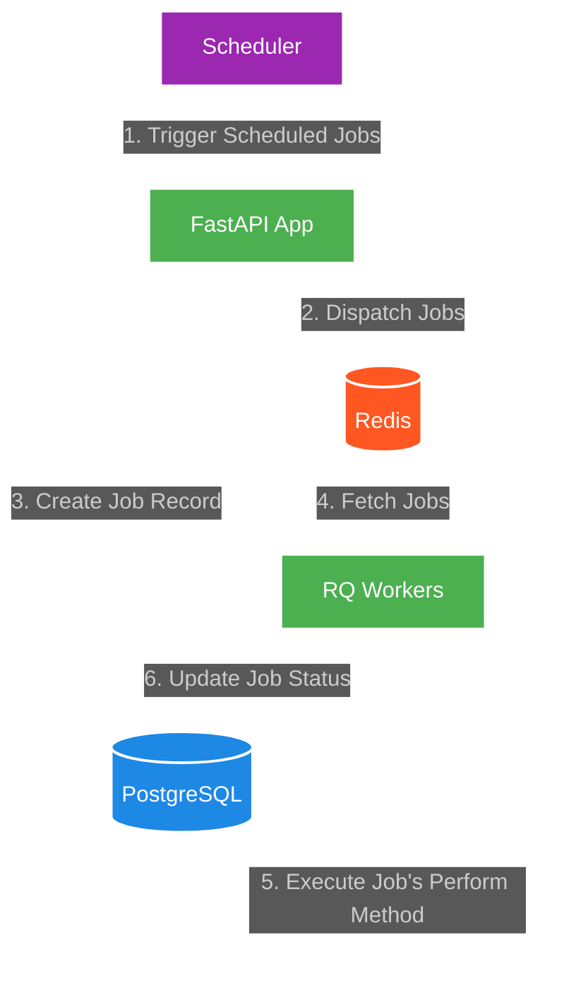

# Asynchronous Job Processing System

## Problem Statement

In large-scale data processing and ETL (Extract, Transform, Load) workflows, organizations often face challenges with scheduling, executing, and monitoring complex database operations. These operations, such as truncating tables, running aggregations, or performing slow queries, need to be executed reliably on a recurring basis without interfering with the main application's performance.

## Expectations

1. Ability to queue jobs for asynchronous processing
2. Efficient execution of jobs without impacting the main application
3. Job status tracking and result retrieval
4. Error handling and job retry mechanism
5. Scalability to handle multiple workers and high job volumes

## Solution

We've implemented an asynchronous job processing system using FastAPI, Redis, Redis Queue (RQ), and SQLAlchemy. This system allows for:

- Queuing jobs from API endpoints
- Processing jobs asynchronously using worker processes
- Storing job statuses and results in a database
- Implementing retry logic for failed jobs
- Scaling by adding more worker processes

## Implementation Details

### Key Components:

1. **FastAPI Application**: Handles API requests and job dispatching
2. **Redis**: Broker for job queues
3. **Redis Queue (RQ)**: Manages job queues and worker processes
4. **SQLAlchemy**: ORM for database operations
5. **PostgreSQL**: Database for storing job statuses and results
6. **Docker**: Containerization for easy deployment and scaling

### `BaseJob` Class:

The `BaseJob` class provides a template for creating new job types. Each job class should implement the `handle` method, which contains the actual job logic. Jobs are dispatched using the `dispatch` class method.

It also has all the necessary methods for handling job status updates, retries, and error handling.

You can create new job classes by inheriting from `BaseJob` and implementing the `handle` method. You can pass the required arguments as well as the queue name when dispatching a job.

Example Job Class:

```python
class TruncateTable(BaseJob):
    def __init__(self, table: str, **kwargs):
        super().__init__(**kwargs)
        self.table = table

    def handle(self):
        logger.info(f"Truncating table {self.table}")

        with get_db() as session:
            session.execute(
                text(f"TRUNCATE TABLE {self.table} RESTART IDENTITY CASCADE;")
            )

        logger.info(f"Table {self.table} truncated successfully")

# Usage
TruncateTable.dispatch(table="auth.users", queue="low")
```


## System Diagram



## System Guarantees

Our asynchronous job processing system provides the following guarantees:

1. **Job Queueing**: Jobs are queued in Redis for processing. Note that if Redis goes down, queued jobs that haven't been processed will be lost.
2. **Job Ordering**: Jobs are processed based on the queue order. Jobs within the same queue are processed in the order they were enqueued.
3. **Job Status Persistence**: All job statuses are persisted in the PostgreSQL database, ensuring this information survives system restarts.
4. **Retry Mechanism**: Failed jobs are automatically retried based on the configured retry policy.
5. **Job Status Tracking**: The status of each job (queued, started, completed, failed) is tracked and can be queried.
6. **Result Persistence**: Job results or errors are stored in the database for debugging and analysis.
7. **Scalability**: The system can be easily scaled by adding more worker processes or nodes.

It's important to note that this system does not guarantee exactly-once execution. In cases of worker failure, a job might be executed more than once. If exactly-once execution is critical for your use case, additional application-level checks should be implemented.

## How to Run

1. Ensure Docker and Docker Compose are installed on your system.
2. Clone the repository:
   ```
   gh repo clone adimyth/async-job-processing-using-redis-queues
   ```
3. Build and start the Docker containers:
   ```
   docker-compose up --build -d
   ```

This will start the FastAPI application, Redis, PostgreSQL, Scheduler and the Worker processes.


## Verification
The scheduler currently invokes the `/create-jobs` endpoint in the FastAPI application to create new jobs every minute. I have created a few sample jobs & added them to different priority queues to demonstrate the system's functionality.

```python
@app.post("/create-jobs/")
async def create_jobs():
    # high priority jobs
    PopulateRecords.dispatch(sql_path="users.sql", queue="high")

    # medium priority jobs
    SlowQuery.dispatch(duration=10, queue="medium")
    DataAggregation.dispatch(
        table="auth.users",
        group_by="department",
        sort_by="total_salary",
        sort_order="desc",
        queue="medium",
    )
    TruncateTable.dispatch(table="auth.users", queue="medium")
    DropTable.dispatch(table="auth.users", queue="low")

    # low priority jobs
    Fibonacci.dispatch(n=10, queue="low")
    FailedJob.dispatch(queue="low")
```


### Worker Logs
After starting the system, you can check the logs of the worker processes to see the job execution:

```bash
# PopulateRecords job execution <-> queue=high 
worker  | 2024-08-09 19:22:00.833 | INFO     | src.jobs.base:perform:41 - Executing job e59d93ac-e5e3-4d33-994f-7116d134945f, attempt 1
worker  | 2024-08-09 19:22:00.847 | INFO     | src.jobs.populate:handle:14 - Populating table
worker  | 2024-08-09 19:22:00.854 | INFO     | src.jobs.populate:handle:23 - Table populated successfully
worker  | 19:22:00 high: Job OK (e59d93ac-e5e3-4d33-994f-7116d134945f)
worker  | 19:22:00 Result is kept for 500 seconds

# Slow Query job execution <-> queue=medium
worker  | 19:22:00 medium: perform(duration=10) (c22157d4-e344-4c6a-b9bb-4ea3c4a2564d)
worker  | 2024-08-09 19:22:01.033 | INFO     | src.jobs.base:perform:41 - Executing job c22157d4-e344-4c6a-b9bb-4ea3c4a2564d, attempt 1
worker  | 2024-08-09 19:22:01.044 | INFO     | src.jobs.slow_query:handle:14 - Executing sleep query for 10 seconds
worker  | 19:22:11 medium: Job OK (c22157d4-e344-4c6a-b9bb-4ea3c4a2564d)
worker  | 19:22:11 Result is kept for 500 seconds

# Data Aggregation job execution <-> queue=medium
worker  | 19:22:11 medium: perform(group_by='department', sort_by='total_salary', sort_order='desc', table='auth.users') (16250443-a1a2-4b89-8c1a-0108247fc5c9)
worker  | 2024-08-09 19:22:11.333 | INFO     | src.jobs.base:perform:41 - Executing job 16250443-a1a2-4b89-8c1a-0108247fc5c9, attempt 1
worker  | 2024-08-09 19:22:11.347 | INFO     | src.jobs.aggregation:handle:16 - Aggregating auth.users grouped by department
worker  | 19:22:11 medium: Job OK (16250443-a1a2-4b89-8c1a-0108247fc5c9)
worker  | 19:22:11 Result is kept for 500 seconds

# Truncate Table job execution <-> queue=medium
worker  | 19:22:11 medium: perform(table='auth.users') (934fc63d-8bb8-4416-9357-7eb518327efc)
worker  | 2024-08-09 19:22:11.522 | INFO     | src.jobs.base:perform:41 - Executing job 934fc63d-8bb8-4416-9357-7eb518327efc, attempt 1
worker  | 2024-08-09 19:22:11.532 | INFO     | src.jobs.truncate:handle:14 - Truncating table auth.users
worker  | 2024-08-09 19:22:11.541 | INFO     | src.jobs.truncate:handle:21 - Table auth.users truncated successfully
worker  | 19:22:11 medium: Job OK (934fc63d-8bb8-4416-9357-7eb518327efc)
worker  | 19:22:11 Result is kept for 500 seconds

# Drop Table job execution <-> queue=low
worker  | 19:22:11 low: perform(table='auth.users') (f3cac0d9-3a18-4e0a-80aa-79baf80fd3c2)
worker  | 2024-08-09 19:22:11.713 | INFO     | src.jobs.base:perform:41 - Executing job f3cac0d9-3a18-4e0a-80aa-79baf80fd3c2, attempt 1
worker  | 2024-08-09 19:22:11.725 | INFO     | src.jobs.drop:handle:14 - Dropping table auth.users
worker  | 2024-08-09 19:22:11.728 | INFO     | src.jobs.drop:handle:19 - Table auth.users dropped successfully
worker  | 19:22:11 low: Job OK (f3cac0d9-3a18-4e0a-80aa-79baf80fd3c2)
worker  | 19:22:11 Result is kept for 500 seconds

# Fibonacci job execution <-> queue=low
worker  | 19:22:11 low: perform(n=10) (08d4ea10-f6e1-4d9c-93a8-0dcf18928bba)
worker  | 2024-08-09 19:22:11.897 | INFO     | src.jobs.base:perform:41 - Executing job 08d4ea10-f6e1-4d9c-93a8-0dcf18928bba, attempt 1
worker  | 2024-08-09 19:22:11.907 | INFO     | src.jobs.fibonacci:handle:12 - Calculating Fibonacci number for n=10
worker  | 19:22:11 low: Job OK (08d4ea10-f6e1-4d9c-93a8-0dcf18928bba)
worker  | 19:22:11 Result is kept for 500 seconds

# Failed Job execution <-> queue=low
worker  | 19:22:11 low: perform() (8ad8d791-6d82-4794-ab6c-7a2305f73b90)
worker  | 2024-08-09 19:22:12.076 | INFO     | src.jobs.base:perform:41 - Executing job 8ad8d791-6d82-4794-ab6c-7a2305f73b90, attempt 1
worker  | 2024-08-09 19:22:12.085 | INFO     | src.jobs.exception:handle:11 - Running FailedJob
worker  | 19:22:12 [Job 8ad8d791-6d82-4794-ab6c-7a2305f73b90]: exception raised while executing (perform)
worker  | Traceback (most recent call last):
worker  |   File "/usr/local/lib/python3.10/site-packages/rq/worker.py", line 1430, in perform_job
worker  |     rv = job.perform()
worker  |   File "/usr/local/lib/python3.10/site-packages/rq/job.py", line 1280, in perform
worker  |     self._result = self._execute()
worker  |   File "/usr/local/lib/python3.10/site-packages/rq/job.py", line 1317, in _execute
worker  |     result = self.func(*self.args, **self.kwargs)
worker  |   File "/app/src/jobs/base.py", line 50, in perform
worker  |     result = instance.handle()
worker  |   File "/app/src/jobs/exception.py", line 13, in handle
worker  |     raise MyException
worker  | src.jobs.exception.MyException: This is a custom exception
worker  |
```

### Job Status Table
The job status and results are stored in the `job` table in the PostgreSQL database.

✅ Successful Case:
| id                                   | payload                                                                                                              | status    | result                                | error | traceback | retry_count | next_retry_time | created_at                 | updated_at                 |
| ------------------------------------ | -------------------------------------------------------------------------------------------------------------------- | --------- | ------------------------------------- | ----- | --------- | ----------- | --------------- | -------------------------- | -------------------------- |
| 11e8ae78-026c-44f8-b7e0-2eb43d306bb7 | "{\"sql_path\": \"users.sql\"}"                                                                                      | completed | None                                  |       |           | 0           |                 | 2024-08-09 17:33:00.58041  | 2024-08-09 17:33:00.883442 |
| 39cbaf4f-c1ce-4655-a3df-1d7dab60f8f6 | "{\"sql_path\": \"users.sql\"}"                                                                                      | completed | None                                  |       |           | 0           |                 | 2024-08-09 17:29:00.586785 | 2024-08-09 17:29:00.85107  |
| db590a64-3dcc-4cb1-a6be-606713fc24c4 | "{\"sql_path\": \"users.sql\"}"                                                                                      | completed | None                                  |       |           | 0           |                 | 2024-08-09 17:31:00.568113 | 2024-08-09 17:31:00.857997 |
| acdc5b23-b077-4f02-9a99-648500e8d447 | "{\"duration\": 10}"                                                                                                 | completed | Slow query completed after 10 seconds |       |           | 0           |                 | 2024-08-09 17:29:00.592025 | 2024-08-09 17:29:11.031892 |
| d4ca38aa-216c-4e98-abe0-ab3e0d0ba969 | "{\"sql_path\": \"users.sql\"}"                                                                                      | completed | None                                  |       |           | 0           |                 | 2024-08-09 17:32:00.56487  | 2024-08-09 17:32:00.82806  |
| 7691f393-b027-4fd8-a6f8-72216f898f0c | "{\"table\": \"auth.users\", \"group_by\": \"department\", \"sort_by\": \"total_salary\", \"sort_order\": \"desc\"}" | completed | Aggregation complete. 5 groups found. |       |           | 0           |                 | 2024-08-09 17:29:00.59469  | 2024-08-09 17:29:11.22892  |


❌ Failed Case:

| id                                   | payload | status | result | error                      | traceback                                                                                 | retry_count | next_retry_time | created_at                 | updated_at                 |
| ------------------------------------ | ------- | ------ | ------ | -------------------------- | ----------------------------------------------------------------------------------------- | ----------- | --------------- | -------------------------- | -------------------------- |
| c4ae4d85-be49-4c2b-bb10-775ea667e338 | "{}     | failed |        | This is a custom exception | Traceback (most recent call last): File "/app/src/jobs/base.py", line 50, in perform .... | 3           |                 | 2024-08-09 19:13:00.589617 | 2024-08-09 19:19:12.802398 |

> [!NOTE]
> Since I have set max retries to 3 with an exponential backoff strategy, the job will be retried 3 times with increasing intervals between retries. After the third attempt, the job will be marked as failed.

### Job Status API
You can check the status of each job by querying the `/jobs/{job_id}` endpoint:

```bash
curl -X GET "http://localhost:8000/job-status/8ad8d791-6d82-4794-ab6c-7a2305f73b90" -H  "accept: application/json"
```

## Using for Cron Jobs and ETLs

This system is well-suited for running ETL (Extract, Transform, Load) jobs and other periodic tasks:

1. **Define Job Classes**: Create specific job classes for each ETL task, inheriting from `BaseJob`.
2. **Schedule Jobs**: Use the scheduler to run these jobs at specified intervals.
3. **Monitor Execution**: Use the job status API and logs to monitor the execution of your ETL jobs.
4. **Handle Dependencies**: For complex ETL pipelines, you can chain jobs or use the job status to trigger dependent jobs.

Example ETL Job:

```python
class DataImportJob(BaseJob):
    def handle(self, args, **kwargs):
        # 1. Extract data from source
        # 2. Transform data
        # 3. Load data into target
        pass

# In scheduler.py
@scheduler.scheduled_job('cron', day_of_week='mon-fri', hour=1)
def nightly_data_import():
    DataImportJob.dispatch(source="external_api", target="data_warehouse", queue="etl")
```

This setup allows you to manage complex ETL workflows with features like retries, status tracking, and scalable execution.

## Additional Use Cases
1. Nightly Database Cleanup:
   1. Truncating temporary tables to free up space
   2. Archiving old data to maintain optimal database performance
2. Scheduled Data Aggregations:
   1. Running complex SQL queries to generate daily or weekly reports
   2. Aggregating user activity data for analytics purposes
3. Database Maintenance Operations:
   1. Rebuilding indexes on large tables during off-peak hours
   2. Running VACUUM operations in PostgreSQL for performance optimization
4. Data Synchronization:
   1. Keeping multiple databases in sync by running differential updates
   2. Mirroring production data to staging environments for testing
5. Slow Query Execution:
   1. Running resource-intensive queries that are too slow for real-time execution
   2. Generating large datasets for business intelligence tools
6. Error Recovery and Data Consistency Checks:
   1. Automatically retrying failed database operations
   2. Running periodic data integrity checks across related tables
