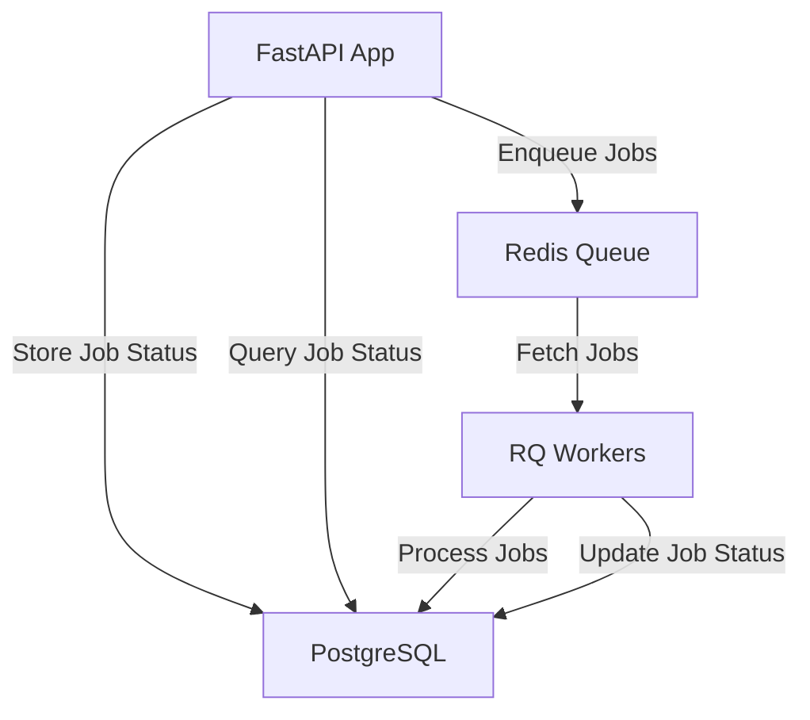

# Asynchronous Job Processing System

## Problem Statement

In many applications, there's a need to handle long-running tasks without blocking the main application flow. These tasks might include data processing, file operations, or complex computations. Running such tasks synchronously can lead to poor user experience and potential timeout issues.

## Expectations

1. Ability to queue jobs for asynchronous processing
2. Efficient execution of jobs without impacting the main application
3. Job status tracking and result retrieval
4. Error handling and job retry mechanism
5. Scalability to handle multiple workers and high job volumes

## Solution

We've implemented an asynchronous job processing system using FastAPI, Redis Queue (RQ), and SQLAlchemy. This system allows for:

- Queuing jobs from API endpoints
- Processing jobs asynchronously using worker processes
- Storing job statuses and results in a database
- Implementing retry logic for failed jobs
- Scaling by adding more worker processes

## Implementation Details

### Key Components:

1. **FastAPI Application**: Handles API requests and job dispatching
2. **Redis Queue (RQ)**: Manages job queues and worker processes
3. **SQLAlchemy**: ORM for database operations
4. **PostgreSQL**: Database for storing job statuses and results
5. **Docker**: Containerization for easy deployment and scaling

### Core Classes:

1. `BaseJob`: Abstract base class for all job types
2. `TruncateTable`: Example job class for truncating database tables
3. `JobStatus`: SQLAlchemy model for storing job statuses

### Key Features:

- Job dispatch with customizable queue selection
- Automatic job status updates (queued, started, completed, failed)
- Exponential backoff retry mechanism
- Database session management using context managers
- Docker-based deployment for all components

## System Diagram



## System Guarantees

Our asynchronous job processing system provides the following guarantees:

1. **Job Queueing**: Jobs are queued in Redis for processing. Note that if Redis goes down, queued jobs that haven't been processed will be lost.
2. **Job Status Persistence**: All job statuses are persisted in the PostgreSQL database, ensuring this information survives system restarts.
3. **Retry Mechanism**: Failed jobs are automatically retried based on the configured retry policy.
4. **Job Status Tracking**: The status of each job (queued, started, completed, failed) is tracked and can be queried.
5. **Result Persistence**: Job results or errors are stored in the database for later retrieval.
6. **Scalability**: The system can be easily scaled by adding more worker processes or nodes.

It's important to note that this system does not guarantee exactly-once execution. In cases of worker failure, a job might be executed more than once. If exactly-once execution is critical for your use case, additional application-level checks should be implemented.

## Job Execution Order

In this setup, job execution order is guaranteed within each queue. RQ processes jobs from each queue in a FIFO (First In, First Out) manner. However, there are some considerations:

1. Jobs in higher priority queues are processed before lower priority queues.
2. If multiple workers are processing the same queue, the exact order of execution may vary slightly due to race conditions.
3. Failed jobs that are retried may be executed out of their original order.

To ensure strict ordering for certain jobs, you can:
- Use a dedicated queue for those jobs
- Implement application-level checks to ensure prerequisites are met before processing

## How to Run

1. Ensure Docker and Docker Compose are installed on your system.
2. Clone the repository:
   ```
   git clone <repository-url>
   cd <project-directory>
   ```
3. Build and start the Docker containers:
   ```
   docker-compose up --build
   ```

This will start the FastAPI application, Redis, PostgreSQL, and worker processes.

## How to Verify

1. Access the FastAPI Swagger UI at `http://localhost:8000/docs`
2. Use the `/create-jobs/` endpoint to queue a new job
3. Note the returned job ID
4. Use the job ID to check the job status via the `/job-status/{job_id}` endpoint
5. Monitor the worker logs in the Docker Compose output to see job execution

## Monitoring and Verification

### Monitoring Docker Logs

To monitor the Docker logs:

```bash
docker-compose logs -f
```

To monitor a specific service (e.g., worker):

```bash
docker-compose logs -f worker
```

### Making Sense of Logs

- API logs will show incoming requests and job creation
- Worker logs will show job execution, completion, and any errors
- Database logs may show query execution (if log level is set appropriately)

### Verifying Correctness

1. Check logs for successful job enqueueing:
   ```
   api_1     | INFO:     127.0.0.1:36245 - "POST /create-jobs/ HTTP/1.1" 200 OK
   ```

2. Look for job execution in worker logs:
   ```
   worker_1  | 12:34:56 Working on job_id
   worker_1  | 12:34:57 Job job_id: completed
   ```

3. Check the `job_statuses` table in the database:
   ```sql
   SELECT * FROM job_statuses ORDER BY created_at DESC LIMIT 5;
   ```

## Job Status API Demo

To check the status of a job:

1. Note the job_id when creating a job:
   ```json
   {"job_id": "1234-5678-90ab-cdef", "status": "enqueued"}
   ```

2. Use the job status API:
   ```bash
   curl http://localhost:8000/job-status/1234-5678-90ab-cdef
   ```

3. You'll receive a response like:
   ```json
   {
     "id": "1234-5678-90ab-cdef",
     "status": "completed",
     "result": "Table public.users truncated successfully",
     "created_at": "2023-05-20T12:34:56",
     "updated_at": "2023-05-20T12:34:57"
   }
   ```

## Scheduler

The scheduler component allows for periodic execution of jobs, similar to cron jobs in Unix-like operating systems. It's particularly useful for recurring tasks like daily data updates, weekly reports, or hourly data synchronization.

### Implementation

Our scheduler uses the `APScheduler` library to define and run scheduled jobs. It's configured to use the same Redis instance as the job queue, ensuring consistency and allowing for distributed scheduling if needed.

### Configuration

Scheduled jobs are defined in the `src/scheduler.py` file. For example:

```python
@scheduler.scheduled_job('cron', hour=2)
def nightly_data_update():
    TruncateTable.dispatch(schema="public", table_name="daily_stats", queue="low")
```

This job will run every day at 2 AM, truncating the `daily_stats` table.

## Using for Cron Jobs and ETLs

This system is well-suited for running ETL (Extract, Transform, Load) jobs and other periodic tasks:

1. **Define Job Classes**: Create specific job classes for each ETL task, inheriting from `BaseJob`.
2. **Schedule Jobs**: Use the scheduler to run these jobs at specified intervals.
3. **Monitor Execution**: Use the job status API and logs to monitor the execution of your ETL jobs.
4. **Handle Dependencies**: For complex ETL pipelines, you can chain jobs or use the job status to trigger dependent jobs.

Example ETL Job:

```python
class DataImportJob(BaseJob):
    def _perform(self):
        # 1. Extract data from source
        # 2. Transform data
        # 3. Load data into target
        pass

# In scheduler.py
@scheduler.scheduled_job('cron', day_of_week='mon-fri', hour=1)
def nightly_data_import():
    DataImportJob.dispatch(source="external_api", target="data_warehouse", queue="etl")
```

This setup allows you to manage complex ETL workflows with features like retries, status tracking, and scalable execution.

## Why It's Useful

This system provides several benefits:

1. **Improved User Experience**: Long-running tasks don't block the main application
2. **Scalability**: Easy to scale by adding more worker processes
3. **Reliability**: Built-in retry mechanism for failed jobs
4. **Visibility**: Job status tracking for monitoring and debugging
5. **Flexibility**: Easy to add new job types by extending the `BaseJob` class

## Expanding and Reusing

1. **New Job Types**: Create new classes inheriting from `BaseJob` for different task types
2. **Additional Queues**: Define new queues in the Docker Compose file for job prioritization
3. **Monitoring**: Integrate with monitoring tools like Prometheus and Grafana
4. **Web Interface**: Implement a web interface for job management using RQ's dashboard or a custom solution
5. **Scheduled Jobs**: Integrate with APScheduler or Celery Beat for recurring jobs
6. **Horizontal Scaling**: Use Docker Swarm or Kubernetes for multi-node deployments
7. **Performance Tuning**: Adjust worker counts, Redis configuration, and database connection pools for optimal performance

## Contributing

Contributions are welcome! Please feel free to submit a Pull Request.

## License

This project is licensed under the MIT License - see the [LICENSE.md](LICENSE.md) file for details.